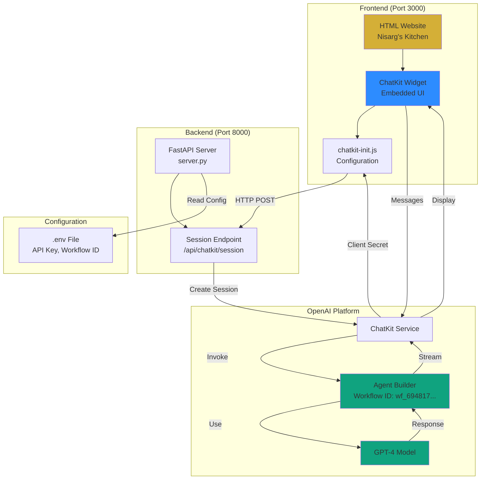
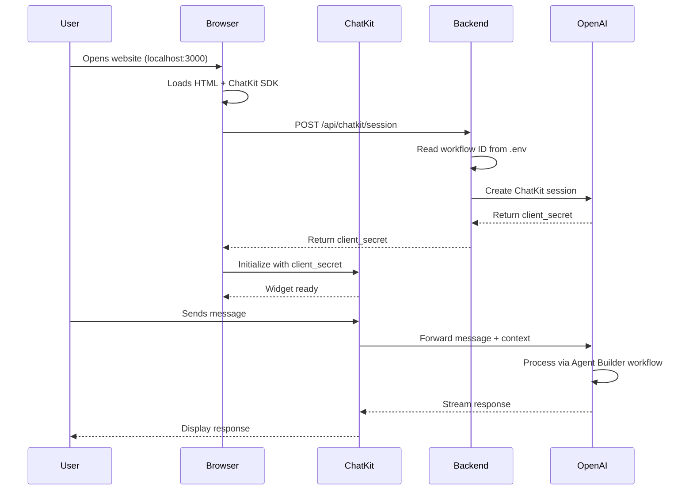
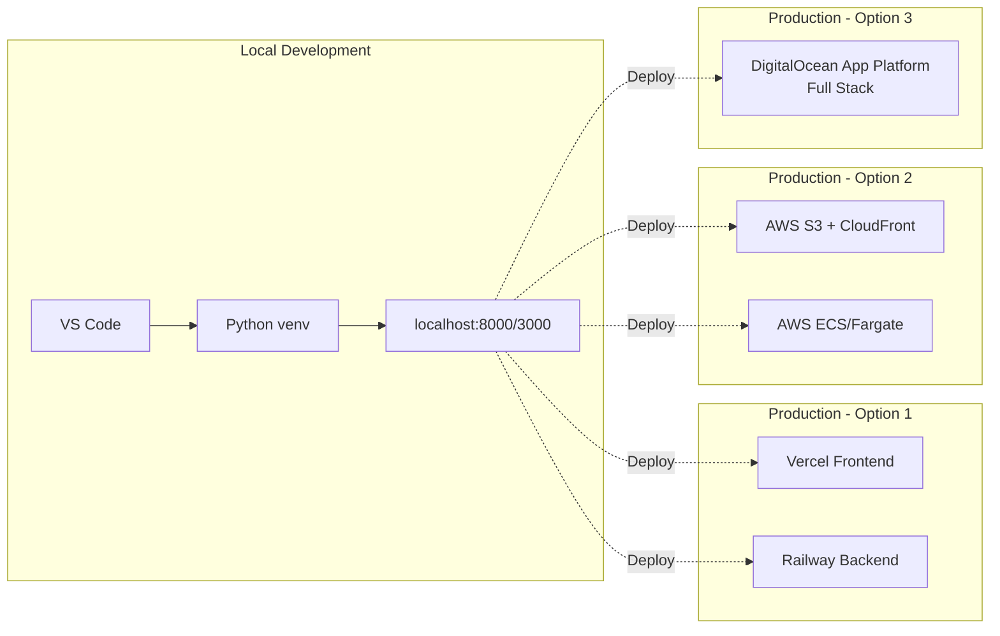
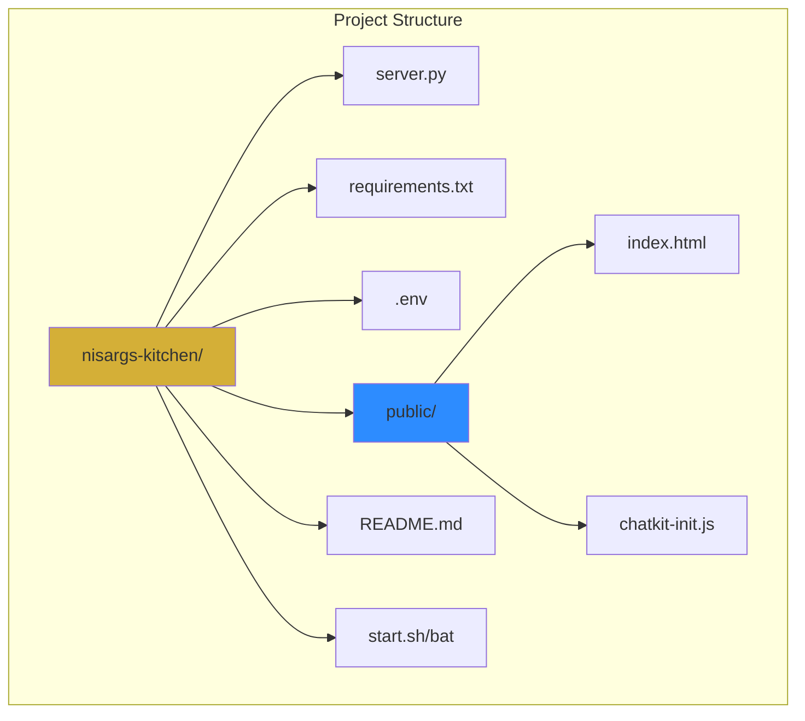

# Architecture Diagram

## System Architecture

## Data Flow

## Deployment Options

## Component Breakdown

---

To view these diagrams:
1. Use any Markdown viewer that supports Mermaid
2. GitHub automatically renders Mermaid diagrams
3. VS Code with Mermaid extension
4. Online tools like Mermaid Live Editor
